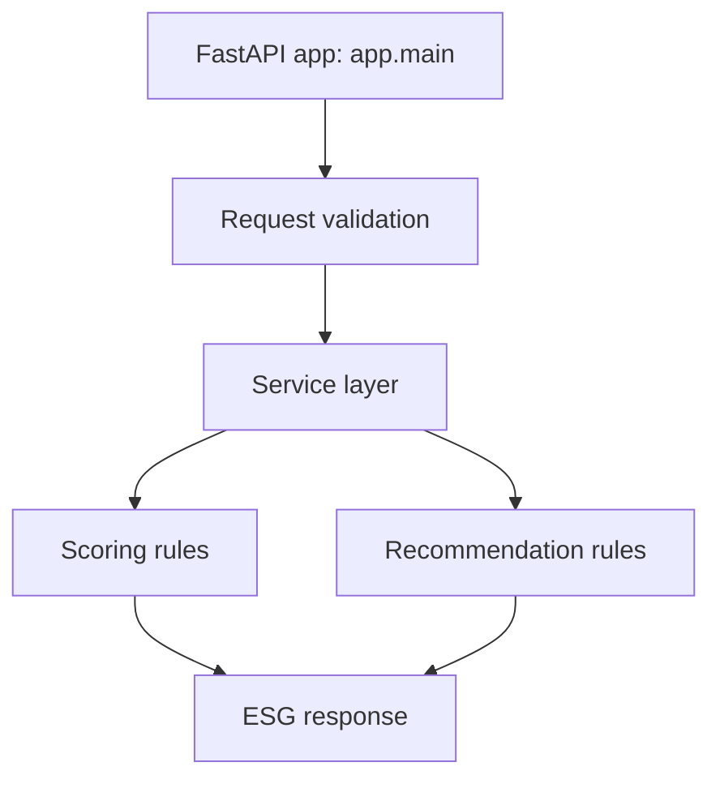

# EcoSphere ML Service

Standalone FastAPI microservice scaffold for the EcoSphere ESG Management Platform.

This repository currently contains **architecture scaffolding only**:

- No scoring logic
- No anomaly logic
- No business rules

It is structured for modular growth, clean separation of concerns, and future ML model integration.

## Tech Baseline

- Python 3.12
- FastAPI
- Pydantic / Pydantic Settings
- Structured logging support
- Unit test structure with pytest

## Quick Start

1. Create and activate a Python 3.12 virtual environment.
2. Install dependencies:

	```bash
	pip install -r requirements.txt
	```

3. Run the service (once the app entrypoint is implemented):

	```bash
	uvicorn app.main:app --reload --port 8000
	```

## Folder Structure

```text
ml-service/
├─ .env.example
├─ README.md
├─ requirements.txt
├─ app/
│  ├─ __init__.py
│  ├─ main.py
│  ├─ api/
│  │  ├─ __init__.py
│  │  └─ v1/
│  │     ├─ __init__.py
│  │     ├─ router.py
│  │     └─ endpoints/
│  │        ├─ __init__.py
│  │        ├─ health.py
│  │        ├─ scoring.py
│  │        └─ anomaly.py
│  ├─ core/
│  │  ├─ __init__.py
│  │  ├─ config.py
│  │  ├─ logging.py
│  │  └─ exceptions.py
│  ├─ dependencies/
│  │  └─ __init__.py
│  ├─ ml/
│  │  ├─ __init__.py
│  │  ├─ artifacts/
│  │  │  └─ .gitkeep
│  │  ├─ features/
│  │  │  ├─ __init__.py
│  │  │  └─ preprocess.py
│  │  ├─ models/
│  │  │  ├─ __init__.py
│  │  │  ├─ loader.py
│  │  │  └─ registry.py
│  │  └─ pipelines/
│  │     ├─ __init__.py
│  │     ├─ anomaly_pipeline.py
│  │     └─ scoring_pipeline.py
│  ├─ repositories/
│  │  └─ __init__.py
│  ├─ schemas/
│  │  ├─ __init__.py
│  │  ├─ common.py
│  │  ├─ health.py
│  │  ├─ scoring.py
│  │  └─ anomaly.py
│  ├─ services/
│  │  ├─ __init__.py
│  │  ├─ scoring_service.py
│  │  └─ anomaly_service.py
│  └─ utils/
│     ├─ __init__.py
│     ├─ constants.py
│     └─ types.py
└─ tests/
	├─ __init__.py
	├─ conftest.py
	└─ unit/
		├─ __init__.py
		├─ test_health.py
		├─ test_scoring_service.py
		└─ test_anomaly_service.py
```

## Purpose of Every File

- `.env.example`: template for environment variables used by the ML service.
- `README.md`: service documentation, setup instructions, and architecture notes.
- `requirements.txt`: pinned Python dependencies for runtime and unit testing.

- `app/__init__.py`: marks `app` as a Python package.
- `app/main.py`: FastAPI application entrypoint (app initialization and startup wiring).

- `app/api/__init__.py`: package marker for API layer.
# EcoSphere ML Service

EcoSphere ML Service is the FastAPI microservice that powers rule-based ESG scoring and recommendations for the EcoSphere platform. It is designed to stay modular, production-ready, and easy to extend with ML models later.

The current implementation is intentionally deterministic. It exposes health and ESG calculation endpoints, uses structured logging, and returns a rule-based recommendation list with no authentication or database dependency.

## Architecture

The service follows a simple layered architecture:



Layer responsibilities:

- `app.main` owns the FastAPI app, middleware, error handlers, and routes.
- `app.schemas.schemas` defines request and response models.
- `app.services.rules` contains reusable score functions.
- `app.services.environmental`, `app.services.social`, and `app.services.governance` orchestrate domain-specific score bundles.
- `app.services.calculator` combines the domain scores into a weighted ESG result.
- `app.services.recommendations` converts low scores into rule-based recommendations.

## Folder Structure

```text
ml-service/
├─ README.md
├─ requirements.txt
├─ app/
│  ├─ main.py
│  ├─ schemas/
│  │  └─ schemas.py
│  └─ services/
│     ├─ rules.py
│     ├─ environmental.py
│     ├─ social.py
│     ├─ governance.py
│     ├─ calculator.py
│     └─ recommendations.py
└─ tests/
	 ├─ conftest.py
	 └─ unit/
			├─ test_rules.py
			├─ test_calculator.py
			├─ test_recommendations.py
			└─ test_main.py
```

## How to Install

1. Create and activate a virtual environment.
2. Install dependencies from the service directory:

```bash
pip install -r requirements.txt
```

Optional: run the test suite after installation.

```bash
pytest
```

## How to Run

Start the API with Uvicorn from the `ml-service` directory:

```bash
uvicorn app.main:app --host 0.0.0.0 --port 8000 --reload
```

For a production deployment, remove `--reload` and run behind your preferred process manager or container platform.

## API Documentation

Base URL:

```text
http://localhost:8000
```

### GET /

Returns a simple service identity response.

Example response:

```json
{
	"message": "EcoSphere ML Service is running",
	"status": "ok"
}
```

### GET /health

Returns a lightweight health response.

Example response:

```json
{
	"status": "healthy",
	"service": "eco-sphere-ml-service"
}
```

### POST /calculate-esg

Accepts the ESG request schema and returns the final ESG JSON payload.

Request schema:

- `department.name` is required.
- `department.code` is optional.
- `environment_metrics.values`, `social_metrics.values`, and `governance_metrics.values` are metric maps.

Example request:

```json
{
	"department": {
		"name": "Sustainability",
		"code": "ESG-01"
	},
	"environment_metrics": {
		"values": {
			"carbon": 12.5,
			"water": 7.0,
			"energy": 80.0
		}
	},
	"social_metrics": {
		"values": {
			"csr": 10.0,
			"training": 25.0
		}
	},
	"governance_metrics": {
		"values": {
			"audit": 3.0,
			"risk": 8.0
		}
	}
}
```

Example response:

```json
{
	"scores": {
		"environment_score": 50,
		"social_score": 50,
		"governance_score": 50,
		"overall_esg": 50
	},
	"rating": "Critical",
	"recommendations": [],
	"validation_errors": []
}
```

Validation error example:

```json
{
	"detail": [
		{
			"type": "missing",
			"loc": ["body", "department"],
			"msg": "Field required",
			"input": {}
		}
	],
	"message": "Request validation failed"
}
```

## Example Requests

### cURL

```bash
curl -X POST http://localhost:8000/calculate-esg \
	-H "Content-Type: application/json" \
	-d '{
		"department": {"name": "Sustainability", "code": "ESG-01"},
		"environment_metrics": {"values": {"carbon": 12.5, "water": 7.0}},
		"social_metrics": {"values": {"csr": 10.0}},
		"governance_metrics": {"values": {"audit": 3.0}}
	}'
```

### HTTPie

```bash
http POST :8000/calculate-esg \
	department:='{"name":"Sustainability","code":"ESG-01"}' \
	# EcoSphere ML Service

	EcoSphere ML Service is the FastAPI microservice that powers rule-based ESG scoring and recommendations for the EcoSphere platform. It is modular, production-ready, and designed to evolve into ML-backed scoring later.

	The current implementation is deterministic. It exposes health and ESG calculation endpoints, uses structured logging, and returns a rule-based recommendation list with no authentication or database dependency.

	## Architecture

	The service follows a layered design:

	```mermaid
	flowchart TD
			A[FastAPI app: app.main] --> B[Request validation]
			B --> C[Service layer]
			C --> D[Scoring rules]
			C --> E[Recommendation rules]
			D --> F[ESG response]
			E --> F
	```

	Layer responsibilities:

	- `app.main` owns the FastAPI app, middleware, error handlers, and routes.
	- `app.schemas.schemas` defines request and response models.
	- `app.services.rules` contains reusable score functions.
	- `app.services.environmental`, `app.services.social`, and `app.services.governance` orchestrate domain-specific score bundles.
	- `app.services.calculator` combines the domain scores into a weighted ESG result.
	- `app.services.recommendations` converts low scores into rule-based recommendations.

	## Folder Structure

	```text
	ml-service/
	├─ README.md
	├─ requirements.txt
	├─ app/
	│  ├─ main.py
	│  ├─ schemas/
	│  │  └─ schemas.py
	│  └─ services/
	│     ├─ rules.py
	│     ├─ environmental.py
	│     ├─ social.py
	│     ├─ governance.py
	│     ├─ calculator.py
	│     └─ recommendations.py
	└─ tests/
		 ├─ conftest.py
		 └─ unit/
				├─ test_rules.py
				├─ test_calculator.py
				├─ test_recommendations.py
				└─ test_main.py
	```

	## How to Install

	1. Create and activate a virtual environment.
	2. Install dependencies from the service directory.

	```bash
	pip install -r requirements.txt
	```

	Optional: run the test suite after installation.

	```bash
	pytest
	```

	## How to Run

	Start the API with Uvicorn from the `ml-service` directory.

	```bash
	uvicorn app.main:app --host 0.0.0.0 --port 8000 --reload
	```

	For production, remove `--reload` and run the app behind your preferred process manager or container platform.

	## API Documentation

	Base URL:

	```text
	http://localhost:8000
	```

	### GET /

	Returns a simple service identity response.

	Example response:

	```json
	{
		"message": "EcoSphere ML Service is running",
		"status": "ok"
	}
	```

	### GET /health

	Returns a lightweight health response.

	Example response:

	```json
	{
		"status": "healthy",
		"service": "eco-sphere-ml-service"
	}
	```

	### POST /calculate-esg

	Accepts the ESG request schema and returns the final ESG JSON payload.

	Request schema:

	- `department.name` is required.
	- `department.code` is optional.
	- `environment_metrics.values`, `social_metrics.values`, and `governance_metrics.values` are metric maps.

	Example request:

	```json
	{
		"department": {
			"name": "Sustainability",
			"code": "ESG-01"
		},
		"environment_metrics": {
			"values": {
				"carbon": 12.5,
				"water": 7.0,
				"energy": 80.0
			}
		},
		"social_metrics": {
			"values": {
				"csr": 10.0,
				"training": 25.0
			}
		},
		"governance_metrics": {
			"values": {
				"audit": 3.0,
				"risk": 8.0
			}
		}
	}
	```

	Example response:

	```json
	{
		"scores": {
			"environment_score": 50,
			"social_score": 50,
			"governance_score": 50,
			"overall_esg": 50
		},
		"rating": "Critical",
		"recommendations": [],
		"validation_errors": []
	}
	```

	Validation error example:

	```json
	{
		"detail": [
			{
				"type": "missing",
				"loc": ["body", "department"],
				"msg": "Field required",
				"input": {}
			}
		],
		"message": "Request validation failed"
	}
	```

	## Example Requests

	### cURL

	```bash
	curl -X POST http://localhost:8000/calculate-esg \
		-H "Content-Type: application/json" \
		-d '{
			"department": {"name": "Sustainability", "code": "ESG-01"},
			"environment_metrics": {"values": {"carbon": 12.5, "water": 7.0}},
			"social_metrics": {"values": {"csr": 10.0}},
			"governance_metrics": {"values": {"audit": 3.0}}
		}'
	```

	### HTTPie

	```bash
	http POST :8000/calculate-esg \
		department:='{"name":"Sustainability","code":"ESG-01"}' \
		environment_metrics:='{"values":{"carbon":12.5,"water":7.0}}' \
		social_metrics:='{"values":{"csr":10.0}}' \
		governance_metrics:='{"values":{"audit":3.0}}'
	```

	## Example Responses

	Current implementation returns deterministic placeholder scores from the rule layer, so a successful response currently looks like this:

	```json
	{
		"scores": {
			"environment_score": 50,
			"social_score": 50,
			"governance_score": 50,
			"overall_esg": 50
		},
		"rating": "Critical",
		"recommendations": [],
		"validation_errors": []
	}
	```

	When the rule thresholds are connected to real metric inputs, the recommendation list will start returning items such as:

	- Install LED lighting
	- Use renewable energy
	- Reduce diesel use
	- Increase CSR events
	- Run employee awareness campaigns
	- Launch volunteer programs

	## Future ML Roadmap

	The current service is rule-based only. The roadmap for the next iteration is:

	1. Replace placeholder score functions with real metric-driven scoring logic.
	2. Introduce model-backed scoring pipelines for environmental, social, and governance dimensions.
	3. Add explainability metadata so each score can be traced to contributing features.
	4. Expand recommendation ranking with confidence or priority signals.
	5. Add versioned model registry support and artifact loading.
	6. Introduce async observability, metrics, and audit logging for production operations.

	## Notes

	- No authentication is configured.
	- No database is required.
	- The FastAPI app is safe to run locally or behind a production ASGI server.
